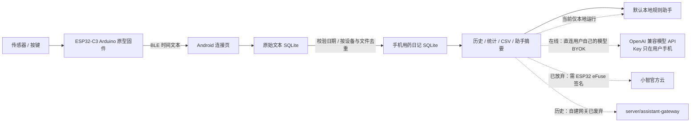

# parcel · ESP32 Medication Device

ESP32 用药装置与 Flutter Android App，供 iGEM 原型开发与开源复现。**当前只继续开发 Android；iOS 工程及已有构建记录保留为历史资料，不再作为本轮交付目标。**

**关于小智：已放弃。** Android App 既不能用 xiaozhi.me 官方云（设备激活要求用 ESP32 eFuse 里的 HMAC 密钥签名，手机做不到），也不继续走自建 `xiaozhi-esp32-server` 智控台（大模型 Key 归服务器、记忆共享，与「API Key 不经过团队服务器」冲突）。**在线助手的现行路线是 App 直连用户自己的模型（BYOK）**：Key 由用户运行时填入、加密保存在手机（`flutter_secure_storage`），调用时直接发送给所选模型服务、不经过团队服务器，并带设备端 RAG 检索与朗读。旧的自建网关留作历史。规则见[模型接入与边界](docs/assistant-model-access.md)。

## 系统组成



App 侧接口与上游解耦：切换网关上游不需要改 App。官方云这条路线已经核查为**不可用**（需要 ESP32 eFuse 的 HMAC 签名，且官方没有第三方 App 的聊天 API），所以**不要按“等官方云接通”来排期**。

## 当前完成情况

| 模块 | 已实现 | 仍需完成 |
|---|---|---|
| Android App 0.4.0 | 英文界面、浅紫浅橙主题、按键时间自动转为用药记录、旧记录补录、去重、历史/统计/CSV/助手、无演示数据 | Android 真机整机验收、正式发布签名 |
| BLE 原型 | 扫描、连接、Notify、分片与 CRC、文本落库后 ACK/COMMIT、重试与去重；手机自动/手动校时、NVS 时钟快照、空闲浅睡眠与按键唤醒 | 与硬件组逐项实测校时、浅睡眠唤醒、断线、掉电、重传及功耗 |
| 正式事件同步 | 数据模型、事务保存、冲突拒绝、连续位置等 App 基础 | 正式事件解码入库、游标续传、校时、按确认范围回收设备日志 |
| 文字助手 | 本地规则引擎（9 条规则、可单测）；概览页“需要留意”卡片；在线助手 = 直连用户自己的模型（BYOK）、摘要发送确认与错误处理；设备端 RAG 关键词检索；系统 TTS 朗读 | 真实模型的端到端验收 |
| 小智语音 / 网关 / iOS | 历史资料保留（`server/assistant-gateway` 已废弃） | 不属于本轮交付 |

**团队约定每条有效按键时间记录自动计为一次用药记录。** 0.4.0 将原文保留后映射到用药日记，供首页、历史、CSV 和助手使用；同设备同文件重传不重复计次，旧版保存的全部时间文本会自动补录。非法日期、2000 年占位和未来时间不计入按日次数。未提供的传感器数据和原始时区不补造。设备动作不证明实际服药，也不测量剂量。完整口径见 [App README](mobile_app/README.md)。

硬件组 `main` 的手机校时与浅睡眠功能已移入本开发线，并保留 P01 的保存后 ACK、防重名与不清空设备文件逻辑。请同时升级本分支 APK 和整套 ESP32-C3 固件；无连接空闲 30 秒后设备睡眠，先按 GPIO4 按钮唤醒再扫描。唤醒会保存按键记录并软件重启恢复广播，避免当前 Arduino BLE 库反复重建服务产生泄漏；实测通过后再整合主分支。

**连接成功却卡在 HELLO/READY：先确认板上刷的是本开发分支的完整固件；旧 `main` 不实现该握手。握手修正版在串口打印 `READY_FIX_1`，并修复 C3 NimBLE 下误关闭 Notify 的兼容问题。手机可继续使用现有 TIME1 APK。**

## 从哪里开始

- 安装、体验与编译：[Android App 说明](mobile_app/README.md)。
- 本轮分工与验收：[Android 开发路线](docs/android-roadmap.md)。
- 连接现有硬件：[A+B 联调说明](docs/member-ab-integration.md)。
- 本地规则集与安全边界：[助手规则说明](docs/assistant-local-rules.md)、[助手数据需求](docs/assistant-data-requirements.md)。
- 本地专家 vs 联网大模型（BYOK、Key 加密保存在手机、RAG 与朗读）：[模型接入与边界](docs/assistant-model-access.md)。
- 历史资料：小智官方云不可用原因与自建网关（已废弃）见 [docs/xiaozhi-official-cloud.md](docs/xiaozhi-official-cloud.md)、[server/assistant-gateway/README.md](server/assistant-gateway/README.md)、[protocol/xiaozhi-bridge.md](protocol/xiaozhi-bridge.md)。

```bash
git clone https://github.com/zyc-ivsd/esp32-medication-device.git
cd esp32-medication-device
# 本轮开发分支；合入 main 后可直接使用 main。
git switch codex/android-xiaozhi-prep
cd mobile_app
flutter pub get --enforce-lockfile
flutter analyze
flutter test
flutter build apk --debug
```

使用 Flutter 3.47.4、Dart 3.13.3、JDK 17、Android SDK 36；最低 Android 7.0 / API 24。打开 App 后从概览进入设备连接页，授权蓝牙并连接装置；没有设备事件记录时显示空状态。App 用法可直接询问本地规则助手，在线问答需配置用户自己的模型服务。Android 自动检查配置见 [.github/workflows](.github/workflows/README.md)，实际通过情况以对应提交的日志为准。

## 仓库目录

| 目录 | 用途 |
|---|---|
| `firmware/` | ESP32-C3 Arduino 原型；S3 / ESP-IDF 是早期目标，尚非可编译迁移工程 |
| `mobile_app/` | Flutter Android 主应用；保留历史 iOS 工程 |
| `protocol/` | BLE 和助手协议，共同接口依据 |
| `server/assistant-gateway/` | 历史 Python 自建文字网关；当前 Android 直接调用用户自己的模型 API |
| `tools/python/` | 可选电脑端 BLE 调试工具，App 不依赖它运行 |
| `hardware/`、`samples/` | 硬件资料、示例数据 |
| `docs/` | 当前任务入口及历史交接记录 |

固件入口为 `firmware/esp32-c3/main/main.ino`，烧录前请按硬件组确认的板型、Arduino 库与接线操作。不要把协议目标说明视为固件已实现的证据。

代码采用 [MIT License](LICENSE)；第三方组件遵守各自许可证。不要提交 Token、私钥、个人蓝牙地址或真实用户记录。
